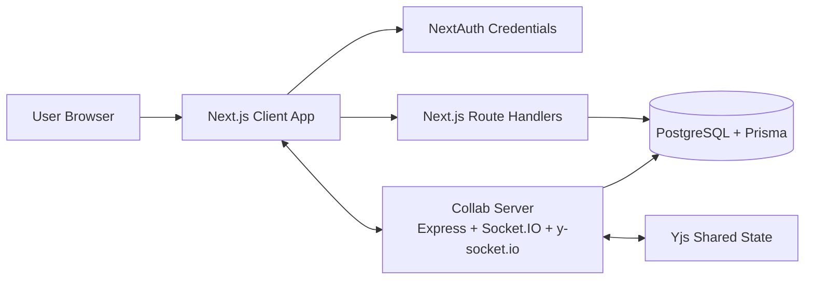
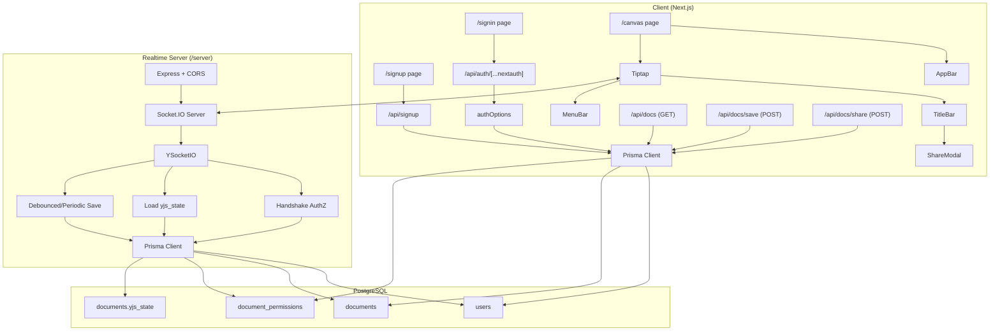
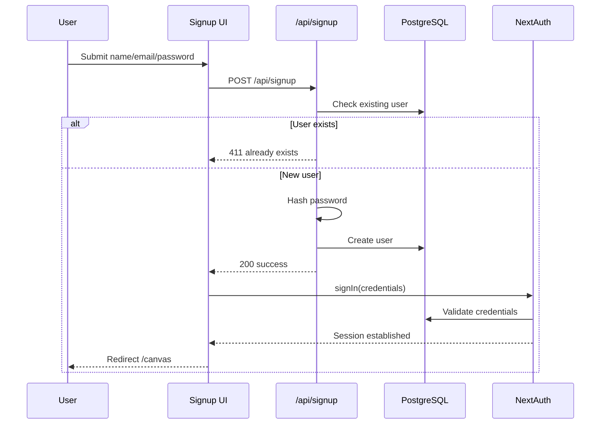
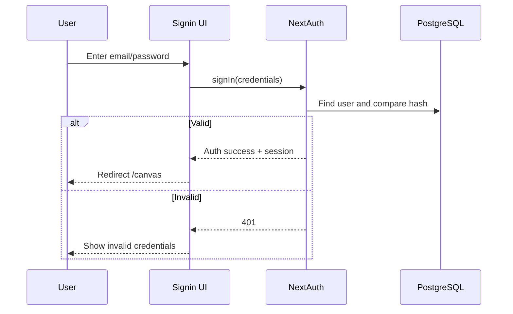
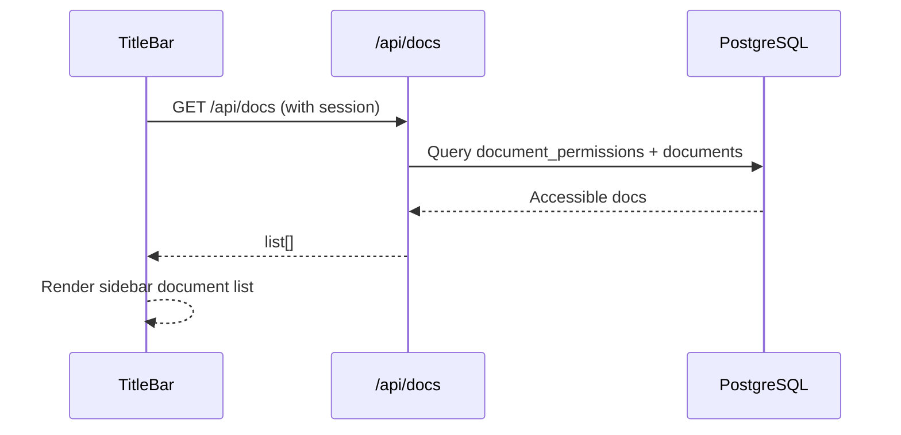
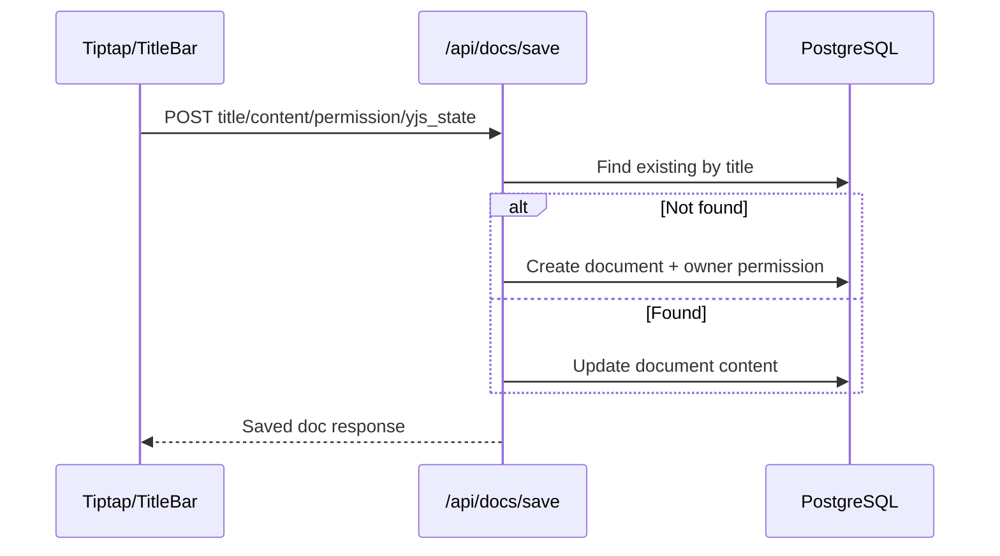
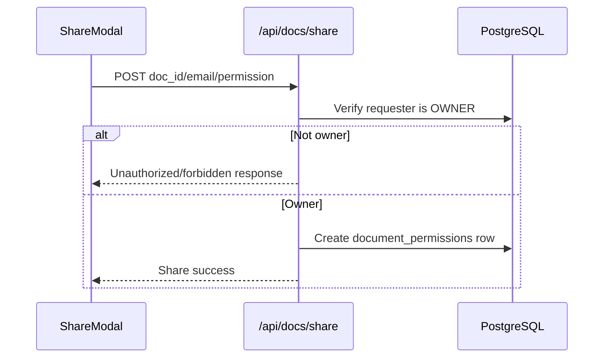
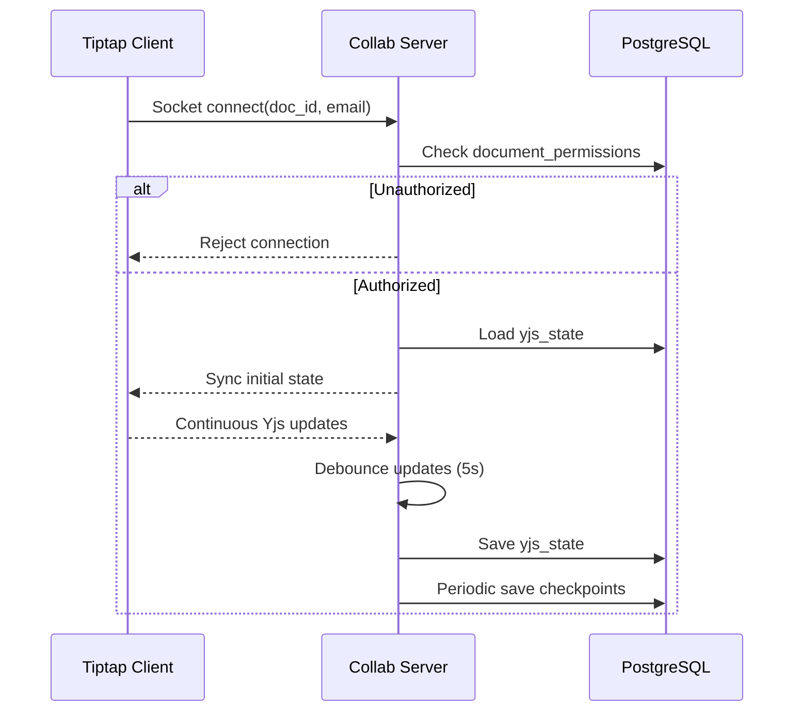
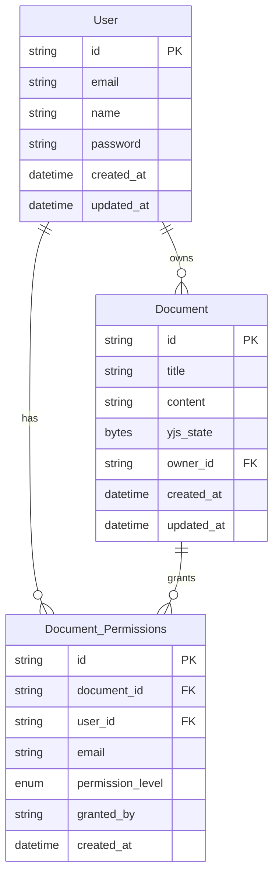

# Realtime Collaborative Docs Platform

A full-stack collaborative document editor with authentication, role-based sharing, rich text editing, and realtime multi-user collaboration.

---

## 1) Project Summary

This project is composed of:

- **Client (`/client`)**: Next.js App Router application
  - Sign up / sign in
  - Document editor UI (Tiptap)
  - Save/load/share APIs
  - Session management using NextAuth credentials provider
- **Collaboration Server (`/server`)**: Express + Socket.IO + Yjs sync server
  - Realtime collaboration over websocket
  - Permission check on document join
  - Debounced + periodic persistence of Yjs state
- **Database**: PostgreSQL accessed through Prisma ORM

---

## 2) High Level Design (HLD)



### HLD Notes

- Authentication is handled in the Next.js layer.
- Core document metadata/content is persisted through Next.js APIs to PostgreSQL.
- Realtime editor sync is handled by Yjs + Socket.IO server.
- Collaboration server persists binary Yjs state (`yjs_state`) back to DB for durability.

---

## 3) Low Level Design (LLD)



---

## 4) Functional Requirements

### Authentication and User Management

- User can sign up with `name`, `email`, `password`.
- Password must be hashed before DB storage.
- User can sign in using credentials provider (NextAuth).
- Session contains user identity used by protected APIs.

### Document Management

- User can create and save a document.
- User can update an existing document.
- User can fetch document list available by direct email or linked user permission.
- Owner can share document with another email and assign permission.

### Permission Model

- Permission levels: `OWNER`, `EDITOR`, `VIEWER`.
- Only authorized users can access document data.
- Collaboration join is allowed only for users with permission entry for the document.

### Realtime Collaboration

- Multiple users can edit the same document concurrently.
- Client joins realtime room using `doc_id` and user email.
- Collaboration server authenticates join request using DB permission lookup.
- Yjs updates are synchronized to connected participants.

### Persistence

- Standard content persisted through `/api/docs/save`.
- Yjs binary state persisted from collaboration server:
  - debounced on updates
  - periodic background checkpoints

---

## 5) Non-Functional Requirements

- **Security**
  - Credential authentication with hashed passwords (`bcrypt`).
  - Server-side permission validation before data access.
  - CORS configured for local frontend origin.
- **Performance**
  - Debounced save for high-frequency collaboration updates.
  - Periodic save as backup durability strategy.
- **Reliability**
  - Collaboration state recovered from persisted `yjs_state`.
  - Unauthorized room join attempts are rejected.
- **Accessibility**
  - Dialog/Sheet components should include titles for screen reader support.
- **Scalability (current baseline)**
  - Single collaboration server instance.
  - DB-backed shared state enables restart recovery.

---

## 6) End-to-End Workflows

### 6.1 Signup and Auto-login



### 6.2 Signin



### 6.3 Load Documents



### 6.4 Save Document



### 6.5 Share Document



### 6.6 Realtime Collaboration



---

## 7) Data Model



---

## 8) APIs

### Auth

- `GET/POST /api/auth/[...nextauth]`
  - NextAuth handler for credential-based login/session.

### User

- `POST /api/signup`
  - Creates user after schema validation and password hash.

### Documents

- `GET /api/docs`
  - Returns documents accessible to authenticated user.
- `POST /api/docs/save`
  - Creates or updates a document.
- `POST /api/docs/share`
  - Owner grants permission to another email.

---

## 9) Tech Stack

- **Frontend**: Next.js 15, React 19, TypeScript, TailwindCSS, Radix UI
- **Editor**: Tiptap + Yjs
- **Auth**: NextAuth (Credentials)
- **Realtime**: Socket.IO + y-socket.io
- **Backend/ORM**: Node.js, Express, Prisma
- **Database**: PostgreSQL

---

## 10) Setup Requirements

### Prerequisites

- Node.js 18+ (recommended latest LTS)
- npm
- PostgreSQL database (or managed PG like Neon)
- Correct environment variables

### Environment Variables

Set in `client/.env` and `server/.env` as needed:

```env
DATABASE_URL=postgresql://<user>:<password>@<host>/<db>?sslmode=require
NEXTAUTH_SECRET=<strong-secret>
NEXTAUTH_URL=http://localhost:3000
```

---

## 11) Run Instructions

### Install

```bash
cd client && npm install
cd ../server && npm install
```

### Build

```bash
cd client && npm run build
cd ../server && npm run build
```

### Dev Run

```bash
# terminal 1
cd client
npm run dev

# terminal 2
cd server
npm run dev
```

- Client URL: `http://localhost:3000`
- Collaboration server URL: `http://localhost:8080`

---

## 12) Operational Notes

- If database URL changes, restart running dev servers to reload env values.
- Collaboration authorization depends on `document_permissions`.
- `yjs_state` persistence enables recovery across server restarts.
- Ensure Prisma client versions are aligned across client/server packages to avoid mismatch issues.

---

## 13) Future Improvements

- Add migration and seed scripts in root-level orchestration.
- Add refresh token/session hardening and secure cookies by environment.
- Add audit logs for share/revoke actions.
- Add integration and e2e tests for auth + collaboration.
- Add role-based UI guards and clearer permission error messages.
